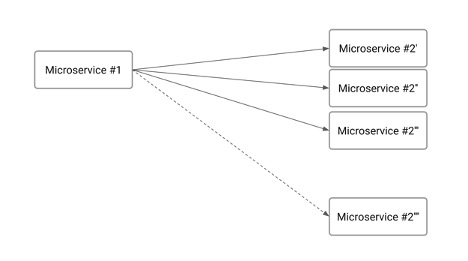
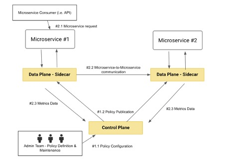
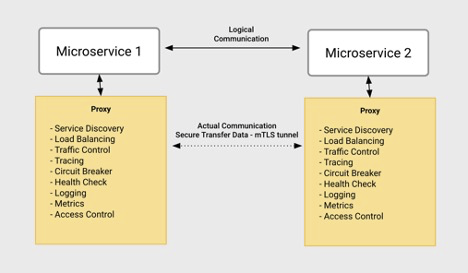

# Faster Microservice-to-Microservice encrypted communication with Kong Mesh and Intel

Service Mesh is an infrastructure layer that has become a common architectural pattern for intra-service transparent communication.

By combining [Kubernetes](https://kubernetes.io) a container orchestration framework, you can form a powerful platform for your microservices cluster, addressing the typical technical requirements that occur in highly distributed environments.

A service mesh is implemented through a sidecar configuration, or proxy instance, for each service instance. The proxy controls interservice communications, security, and monitoring.

On the other hand, Zero-Trust Security becomes even more critical as you transition to a microservice architecture. To implement zero-trust, you can use a mutual TLS to provide the encryption to every request your services are making.

Microservices and Zero-Trust Security can be a chance to make your systems more secure than they were with monolithic applications. On the other hand, the encrypted tunnel implemented with mTLS increases the microservice-to-microservice latency time.

This post will explore how to apply both Kong and Intel technologies to have the best of both worlds: encrypted tunnels with faster microservice communication response times in your Service Mesh deployment.

## The Business Problem
Microservice implementation is based on a very dynamic environment; in time, most organizations will have the burden of managing multiple instances of a Microservice. This situation could arise due to:

1. Throughput: depending on the incoming requests, there might be a higher or lower number of instances of a Microservice.
2. Canary Release.
3. Blue/Green Deployment.

In short, the Microservice-to-Microservice communication has specific requirements and issues to solve.

There are several technical challenges in this example. One of the main responsibilities of Microservice #1 is to balance the load among all Microservice #2 instances; as such, Microservice #1 has to implement Service Discovery and Load Balancing. 

Additionally, Microservice #2 has to implement some Service Registration capability to tell Microservice #1 when a new instance is available.

Additionally, Microservice policies should be developed for the following:
* Service Tracing
* Service Logging
* Service ACL (Access Control List), and more

Beware of these potential problem areas: 
* When microservices are implementing a considerable amount of code not related to the business logic they were originally defined to control.
* Multiple microservices are implementing similar capabilities in a non-standardized process.

A Microservices development team should only focus on implementing business logic; ultimately, they should not be concerned about specific technical needs related to the Microservice distributed environment. Moreover, building non-functional capabilities into applications lacks a centralized governance point of control.

## Secure Data Transfer and Zero-Trust Security
Besides all policies described before, a particular one plays an important role: to make the microservice-to-microservice communication established over a secure and encrypted tunnel.

The best way to achieve this is implementing a Zero-Trust Security environment where the communication tunnel provides natively data authenticity, integrity and privacy.

In fact, a Zero-Trust Security environment provides a scalable way to implement security while managing the microservice-to-microservice connections ensuring authentication, authorization and encryption:
* Authentication to identify the microservice.
* Authorization to control the communication between the microservices.
* Encryption to prevent third parties from viewing the data in transit.

Check the ["The Importance of Zero-Trust Security When Making the Microservices Move"](https://konghq.com/ebooks/the-importance-of-zero-trust-security-when-making-the-microservices-move/) ebook to learn about it.

## Service Mesh Architecture Pattern as the Solution
The purpose of the Service Mesh Architecture Pattern is to extract standard non-functional capabilities of Microservice and apply them as an external component.

A Service Mesh Pattern is defined by two layers, a control plane and a data plane.

* <b>control plane</b>: responsible for managing the policies that will drive the Microservice-to-Microservice communication.
* <b>data plane</b>: responsible for implementing and enforcing the policies described by the control plane. It's the external component where all the non-functional capabilities we've described are implemented. The data plane is composed of proxies deployed as sidecars.

The diagram below shows the relationship between the two layers. Flow #1 shows the admin team going to the control plane to define policies. All the policies are published in the existing sidecars.

Flow #2 shows the sidecars applying the policies previously published to the Microservices communication traffic and reporting to the control plane about their current status. In this sense, for instance, it's worth noting two very important characteristics of the Sidecars.

1. Each one of the Microservices has a respective sidecar taking care of all incoming and outgoing traffic.
2. It is typically implemented as a transparent proxy; whereby, the Microservice doesn't know the sidecar is working very close to it. In doing so, the sidecar is intercepting the traffic and applying the policies previously defined and published by the control plane.

The picture below describes the new Microservice communication and policy enforcement scenario:

From the Secure Data Transfer perspective, again, the sidecars are responsible for implementing the Zero-Trust Security environment ensuring that the communication between your services is encrypted using mTLS (mutual TLS) protocol.

As the mTLS tunnel brings a much more secure environment to our Microservices and Service Mesh, it increases the latency times. That would be a great opportunity for applying specific technologies in order to get optimal results even with encryption in place.

The following "Service Mesh and the Natural Evolution of Microservices" ebook presents the main ideas of the Service Mesh Architecture Pattern and the drivers to implement it in your Microservices project.

## Enter Kong Mesh

[Kong Mesh](https://konghq.com/kong-mesh/) is an enterprise-grade service mesh for multi-cloud and multi-cluster on both Kubernetes and VMs. Totally based on the open source projects [Kuma](https://kuma.io/) and [Envoy](https://www.envoyproxy.io/) proxy, ensures fast, reliable, and secure communication among application infrastructure services as it provides and manages critical capabilities, such as load balancing, discovery, observability, and access control.

Kong Mesh is an "Universal Service Mesh" designed for hybrid deployments with both Kubernetes and VMs. Moreover, its Control Plane can manage multiple and independent Meshes at the same time.

Intel Encryption Technologies

The 3rd Gen Intel® Xeon® Scalable processor (codename Ice Lake) introduced new Advanced Vector Extensions 512 (Intel® AVX-512) instructions to optimize cryptography computation. Combined with Intel’s open source software libraries, such as IPP Cryptography Library, Multi-Buffer Crypto for IPsec Library (intel-ipsec-mb), Intel® QuickAssist Technology (Intel® QAT) and OpenSSL engine. The solutions improve crypto operations’, such as TLS connection handshake performance substantially.
These new components provide batch processing of multiple TLS private key operations in parallel. With the asynchronous private key processing mechanism available both in OpenSSL and BoringSSL, the application software can submit handshake private key requests without having to wait one to return before another one can be submitted. In turn, a callback is called for each request once ready. Underneath, the multi-buffer crypto processing can take 8 such asynchronously submitted private key operations and process them in parallel using the AVX512 SIMD (single instruction multiple data) instructions , greatly improving the overall application performance.
Intel is contributing the accelerated TLS handshake code to the Envoy proxy upstream project. Thus, all the service mesh implementations using Envoy, such as Kuma, can leverage the enhanced performance directly by using the upcoming Envoy releases.
The diagram below compares the regular TLS handshake with the new asynchronous and enhanced one implemented with the new AVX-512 technologies.

Conclusion - The best of both worlds - Service Mesh with fast encrypted communication

A Kong Mesh and Intel Crypto NI based Service Mesh implementation provides a solid, scalable and hybrid infrastructure for your Microservice project without the burden of slow connection times we usually face with encrypted tunnels.

In the next posts, we will show performance results comparing a Kong Mesh implementation with and without Intel's encryption acceleration technologies

Feel free to check additional capabilities provided by Kong to implement high-performance Service Meshes as well as Intel's new Ice Lake processor related technologies.

